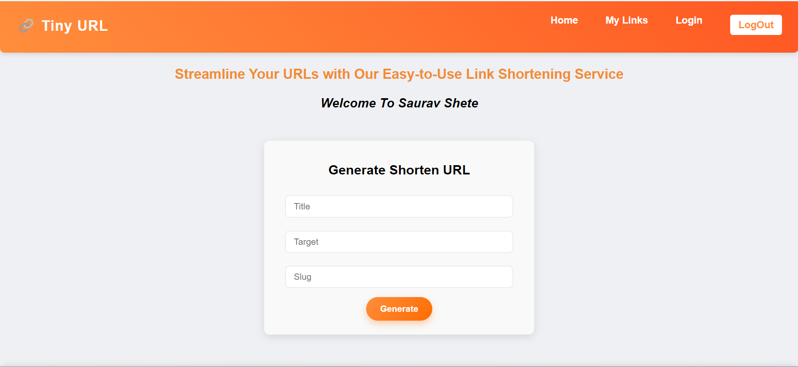

# Tiny URL 🤏🏻

### It is a simple web application that takes a long URL as input and returns a shortened URL.

### The shortened URL is a unique string of characters that can be used to redirect to the original URL

## Features 
<ul>
<li>
<b>URL Shortening</b> : The application takes a long URL as input and
returns a shortened URL.
</li>
<li>
<b>Redirect Functionality</b> : The shortened URL can be used to redirect to the original
</li>
<li>
<b>Unique Shortened URL</b> : Each shortened URL is unique and can be used to
redirect to the original URL.
</li>
</ul>

## Technology 
### Frontend 
<ul>
<li>
<b>HTML</b> : Used for creating the user interface.
</li>
<li>
<b>CSS</b> : Used for styling the user interface.
</li>
<li>
<b>JavaScript</b> : Used for client-side scripting.
</li>
<li><b>
React</b> : Used for building the user interface components.
</li>
</ul>

### Backend
<ul>
<li>
<b>Node.js</b> : Used for creating the server-side logic.
</li>
<li>
<b>Express.js</b> : Used for creating the web server.
</li>
<li><b>
MongoDB</b> : Used for storing the shortened URLs.
</li>
</ul>

## ScreenShot 

## Contact
For any questions or concerns, please feel free to reach out to me at sauravshete72@gmail.com .
Thank you for your time and consideration. I look forward to hearing from you soon.
